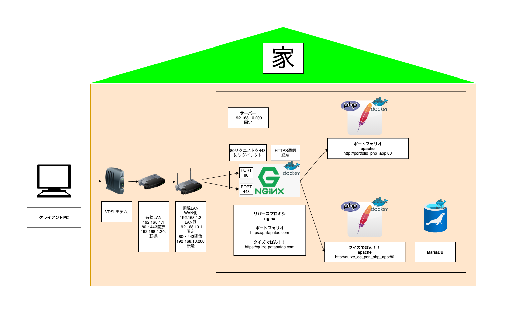

# ***サーバーの構成(さくらのvps)***

※各プロジェクトで、公開しているdocker-compose.ymlなどに記載している詳細と実際の本番環境運用で使用しているものは、セキュリティ上の理由で異なるものとなっています。  
___
## 主な使用技術
	Apache
	Nginx
	Docker
	DockerCompose
___
## サーバー構成図

___

## こだわったポイント

	各プロジェクトの独立性を高めて、ライブラリなどの依存関係の問題などがプロジェクト間で起こってしまわぬよう、シンプルな構成にしたっかった。そして、ローカルで立てたサーバをそのまま本番環境へ瞬時に移植する目的で、Dockerのコンテナ技術を採用しました。
___
## サーバで公開しているプロジェクト

***[ポートフォリオ](https://patao-program.com)***

***[クイズでぽん！！](https://quize.patao-program.com)***
___

[製作者の Twitter](https://twitter.com/Patao_program)